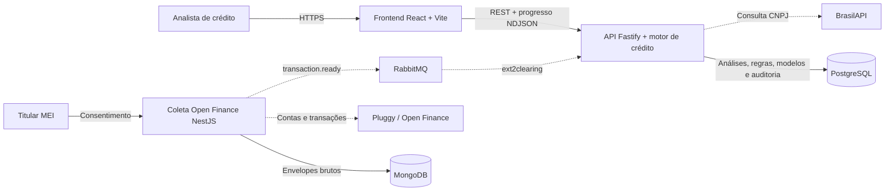
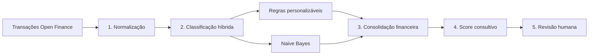

# Arquitetura técnica — ScoreByte

## Visão geral



## Dentro do motor de crédito



## Responsabilidade de cada componente

| Componente | Tecnologia | Responsabilidade |
|---|---|---|
| Frontend | React, TypeScript e Vite | Entrada de CNPJ/JSON, progresso da esteira, políticas e revisão humana |
| API de crédito | Fastify, TypeScript e OpenAPI | Contrato HTTP, autenticação, idempotência, streaming NDJSON e orquestração |
| Motor híbrido | Naive Bayes + regras determinísticas | Classificação explicável das transações entre negócio e pessoal |
| Política de score | TypeScript | Consolidação do fluxo de caixa e recomendação consultiva |
| PostgreSQL | PostgreSQL | Análises, transações normalizadas, modelos, políticas versionadas e auditoria |
| RabbitMQ | AMQP | Integração assíncrona entre coleta e análise |
| Coleta Open Finance | NestJS + Pluggy SDK | Consentimento, coleta de contas/transações e publicação de referências |
| MongoDB | MongoDB/Mongoose | Estado de conexões e envelopes brutos do coletor existente |

## Rastreabilidade no código

```text
FrontEnd/analyst-platform/src/pages/credit-analysis/ui/CreditAnalysisPage.tsx
Interface principal e disparo da análise.

FrontEnd/analyst-platform/src/features/credit-analysis/ui/PipelineJourney.tsx
Progresso visual da esteira.

FrontEnd/analyst-platform/src/pages/policy-manager/ui/PolicyManagerPage.tsx
Personalização das regras de negócio e pessoal, com confirmação por diff,
detecção de edição concorrente e histórico de revisões publicadas.

scor-data-clearing/src/presentation/http-server.ts
API Fastify, OpenAPI, streaming e endpoints de governança.

scor-data-clearing/src/application/pipeline-service.ts
Orquestração das cinco etapas da análise.

scor-data-clearing/src/domain/classifier.ts
Combinação do Naive Bayes com as regras explicáveis.

scor-data-clearing/src/domain/rules-engine.ts
Regras personalizáveis de classificação.

scor-data-clearing/src/infrastructure/database/analysis-repository.ts
Persistência transacional e trilha de auditoria.

scor-data-clearing/src/infrastructure/config/ConfigureRabbitClient.ts
Consumo e publicação RabbitMQ.

EXT-data-collection/src/modules/collection/collection.consumer.ts
Coleta assíncrona de contas e transações Open Finance.
```

> A recomendação é consultiva. A IA classifica movimentações; a política heurística calcula o score; a decisão final permanece humana.

## Ponto de integração a validar

O coletor existente grava os envelopes brutos no MongoDB, enquanto o consumidor atual do `scor-data-clearing` procura `ingestion_envelopes` no PostgreSQL. Para usar o caminho assíncrono de ponta a ponta, é necessário manter um adaptador ou sincronização entre esses dois contratos. O caminho HTTP usado pela aplicação não depende dessa sincronização.
